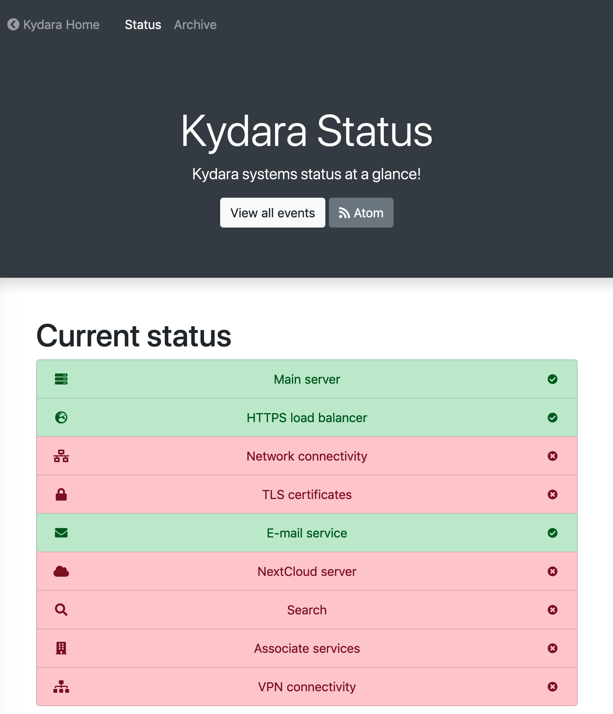

# Andromeda

A universal status page that can be hosted on GitHub, ensuring its availability even if your infrastructure is down.



## Posts

Every post has a header. In Jekyll this is known as "frontmatter".

As a general rule of thumb, you should always separate unrelated incidents. For example, if the server is under a DDoS attack, but you're planning a major upgrade (maintenance) to the system in the future, you should first make a warning post about the DDoS, and then a new post about the planned upgrade, so that when the attack is mitigated or ceases, you can close the incident without affecting the planned upgrade.

In Andromeda, headers look like this:

```frontmatter
---
layout: post
title: YOUR_TITLE
action: YOUR_ACTION
date: YYYY-MM-DD HH:MM
tags: YOUR_TAGS
---
```

- **`layout`**: This field must always be set to "post".
- **`title`**: This title will be shown in the index page. A summary of what's wrong is appropriate. For example "Package upgrade", "API maintenance" or "DDoS attack".
- **`action`**: This field corresponds to the Bootstrap colour class. For errors, use `danger`, for warnings, use `warning`, for when a fix is applied, use `success`, and for informational messages use `info`. For more details, take a look at [the Bootstrap documentation](https://getbootstrap.com/docs/4.3/components/alerts/)
- **`date`**: This field specifies the date for the incident. In almost all cases, it should match the date of releasing the report.
- **`tags`**: This field is an array of tags as defined in the `_data/tags.yml` file. An example of this field could be `[core, web]` or `[maintenance]`.
